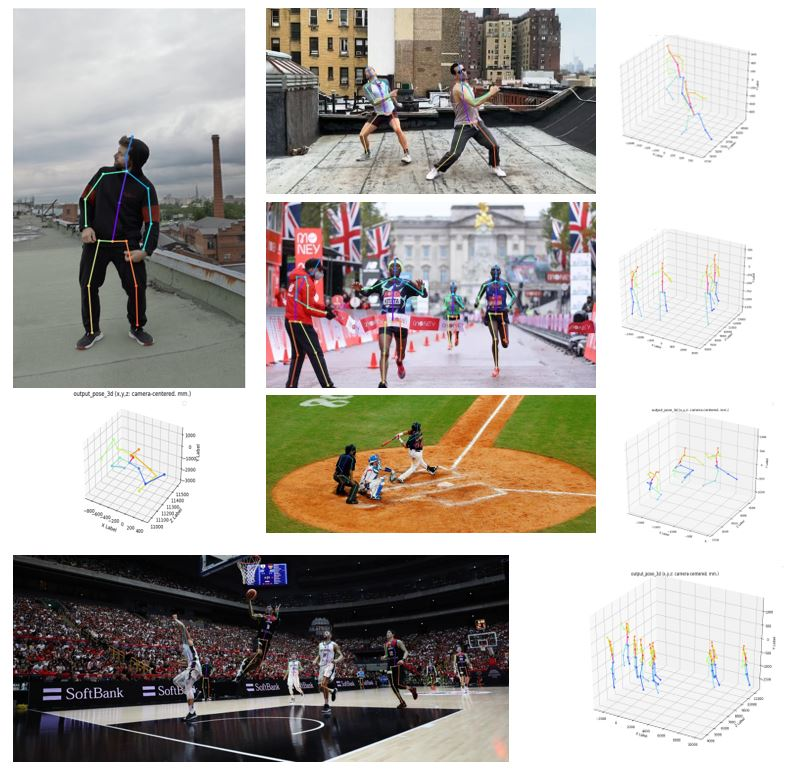
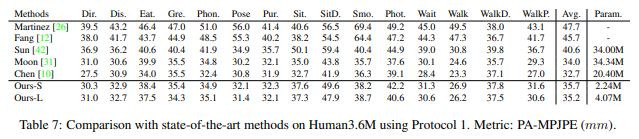
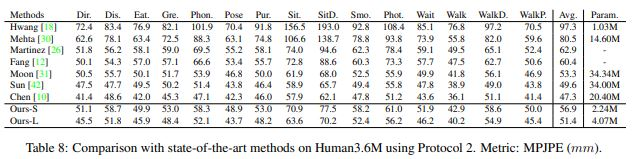
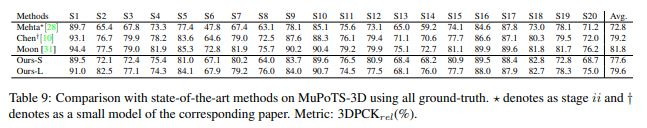

# Github Code of "MobileHumanPose: Toward real-time 3D human pose estimation in mobile devices"

#### [2021.11.23] There will be massive refactoring and optimization expected. It will be released as soon as possible including new model.pth, Please wait for the model!(expecting end of December)

## Introduction

This repo is official **[PyTorch](https://pytorch.org)** implementation of **[MobileHumanPose: Toward real-time 3D human pose estimation in mobile devices(CVPRW 2021)](https://openaccess.thecvf.com/content/CVPR2021W/MAI/html/Choi_MobileHumanPose_Toward_Real-Time_3D_Human_Pose_Estimation_in_Mobile_Devices_CVPRW_2021_paper.html)**.

## Dependencies
* [PyTorch](https://pytorch.org)
* [CUDA](https://developer.nvidia.com/cuda-downloads)
* [cuDNN](https://developer.nvidia.com/cudnn)
* [Anaconda](https://www.anaconda.com/download/)
* [COCO API](https://github.com/cocodataset/cocoapi)

This code is tested under Ubuntu 16.04, CUDA 11.2 environment with two NVIDIA RTX or V100 GPUs.

Python 3.6.5 version with virtualenv is used for development.

## Directory

### Root
The `${ROOT}` is described as below.
```
${ROOT}
|-- data
|-- demo
|-- common
|-- main
|-- tool
|-- vis
`-- output
```
* `data` contains data loading codes and soft links to images and annotations directories.
* `demo` contains demo codes.
* `common` contains kernel codes for 3d multi-person pose estimation system. Also custom backbone is implemented in this repo
* `main` contains high-level codes for training or testing the network.
* `tool` contains data pre-processing codes. You don't have to run this code. I provide pre-processed data below.
* `vis` contains scripts for 3d visualization.
* `output` contains log, trained models, visualized outputs, and test result.

### Data
You need to follow directory structure of the `data` as below.
```
${POSE_ROOT}
|-- data
|   |-- Human36M
|   |   |-- bbox_root
|   |   |   |-- bbox_root_human36m_output.json
|   |   |-- images
|   |   |-- annotations
|   |-- MPII
|   |   |-- images
|   |   |-- annotations
|   |-- MSCOCO
|   |   |-- bbox_root
|   |   |   |-- bbox_root_coco_output.json
|   |   |-- images
|   |   |   |-- train2017
|   |   |   |-- val2017
|   |   |-- annotations
|   |-- MuCo
|   |   |-- data
|   |   |   |-- augmented_set
|   |   |   |-- unaugmented_set
|   |   |   |-- MuCo-3DHP.json
|   |-- MuPoTS
|   |   |-- bbox_root
|   |   |   |-- bbox_mupots_output.json
|   |   |-- data
|   |   |   |-- MultiPersonTestSet
|   |   |   |-- MuPoTS-3D.json
```
* Download Human3.6M parsed data [[data](https://drive.google.com/drive/folders/1kgVH-GugrLoc9XyvP6nRoaFpw3TmM5xK?usp=sharing)]
* Download MPII parsed data [[images](http://human-pose.mpi-inf.mpg.de/)][[annotations](https://drive.google.com/drive/folders/1MmQ2FRP0coxHGk0Ntj0JOGv9OxSNuCfK?usp=sharing)]
* Download MuCo parsed and composited data [[data](https://drive.google.com/drive/folders/1yL2ey3aWHJnh8f_nhWP--IyC9krAPsQN?usp=sharing)]
* Download MuPoTS parsed data [[images](http://gvv.mpi-inf.mpg.de/projects/SingleShotMultiPerson/)][[annotations](https://drive.google.com/drive/folders/1WmfQ8UEj6nuamMfAdkxmrNcsQTrTfKK_?usp=sharing)]
* All annotation files follow [MS COCO format](http://cocodataset.org/#format-data).
* If you want to add your own dataset, you have to convert it to [MS COCO format](http://cocodataset.org/#format-data).

### Output
You need to follow the directory structure of the `output` folder as below.
```
${POSE_ROOT}
|-- output
|-- |-- log
|-- |-- model_dump
|-- |-- result
`-- |-- vis
```
* Creating `output` folder as soft link form is recommended instead of folder form because it would take large storage capacity.
* `log` folder contains training log file.
* `model_dump` folder contains saved checkpoints for each epoch.
* `result` folder contains final estimation files generated in the testing stage.
* `vis` folder contains visualized results.

### 3D visualization
* Run `$DB_NAME_img_name.py` to get image file names in `.txt` format.
* Place your test result files (`preds_2d_kpt_$DB_NAME.mat`, `preds_3d_kpt_$DB_NAME.mat`) in `single` or `multi` folder.
* Run `draw_3Dpose_$DB_NAME.m`

<p align="middle">

</p>

## Running 3DMPPE_POSENET

### Requirements

```shell
cd main
pip install -r requirements.txt
```

### Setup Training
* In the `main/config.py`, you can change settings of the model including dataset to use, network backbone, and input size and so on.

### Train
In the `main` folder, run
```bash
python train.py --gpu 0-1 --backbone LPSKI
```
to train the network on the GPU 0,1. 

If you want to continue experiment, run 
```bash
python train.py --gpu 0-1 --backbone LPSKI --continue
```
`--gpu 0,1` can be used instead of `--gpu 0-1`.

### Test
Place trained model at the `output/model_dump/`.

In the `main` folder, run 
```bash
python test.py --gpu 0-1 --test_epoch 20-21 --backbone LPSKI
```
to test the network on the GPU 0,1 with 20th and 21th epoch trained model. `--gpu 0,1` can be used instead of `--gpu 0-1`. For the backbone you can either choose 
BACKBONE_DICT = {
    'LPRES':LpNetResConcat,
    'LPSKI':LpNetSkiConcat,
    'LPWO':LpNetWoConcat
    }

#### Human3.6M dataset using protocol 1
For the evaluation, you can run `test.py` or there are evaluation codes in `Human36M`.
<p align="center">

</p>

#### Human3.6M dataset using protocol 2
For the evaluation, you can run `test.py` or there are evaluation codes in `Human36M`.
<p align="center">

</p>

#### MuPoTS-3D dataset
For the evaluation, run `test.py`.  After that, move `data/MuPoTS/mpii_mupots_multiperson_eval.m` in `data/MuPoTS/data`. Also, move the test result files (`preds_2d_kpt_mupots.mat` and `preds_3d_kpt_mupots.mat`) in `data/MuPoTS/data`. Then run `mpii_mupots_multiperson_eval.m` with your evaluation mode arguments.
<p align="center">

</p>

#### TFLite inference
For the inference in mobile devices we also tested in mobile devices which converting PyTorch implementation through onnx and finally serving into TFlite.
Official demo app is available in [here](https://github.com/tucan9389/PoseEstimation-TFLiteSwift)

## Reference

**What this repo cames from:**
Training section and is based on following paper and github
* [PyTorch](https://pytorch.org) implementation of [Camera Distance-aware Top-down Approach for 3D Multi-person Pose Estimation from a Single RGB Image (ICCV 2019)](https://arxiv.org/abs/1907.11346).
* Flexible and simple code.
* Compatibility for most of the publicly available 2D and 3D, single and multi-person pose estimation datasets including **[Human3.6M](http://vision.imar.ro/human3.6m/description.php), [MPII](http://human-pose.mpi-inf.mpg.de/), [MS COCO 2017](http://cocodataset.org/#home), [MuCo-3DHP](http://gvv.mpi-inf.mpg.de/projects/SingleShotMultiPerson/) and [MuPoTS-3D](http://gvv.mpi-inf.mpg.de/projects/SingleShotMultiPerson/)**.
* Human pose estimation visualization code.

```
@InProceedings{Choi_2021_CVPR,
    author    = {Choi, Sangbum and Choi, Seokeon and Kim, Changick},
    title     = {MobileHumanPose: Toward Real-Time 3D Human Pose Estimation in Mobile Devices},
    booktitle = {Proceedings of the IEEE/CVF Conference on Computer Vision and Pattern Recognition (CVPR) Workshops},
    month     = {June},
    year      = {2021},
    pages     = {2328-2338}
}
```

